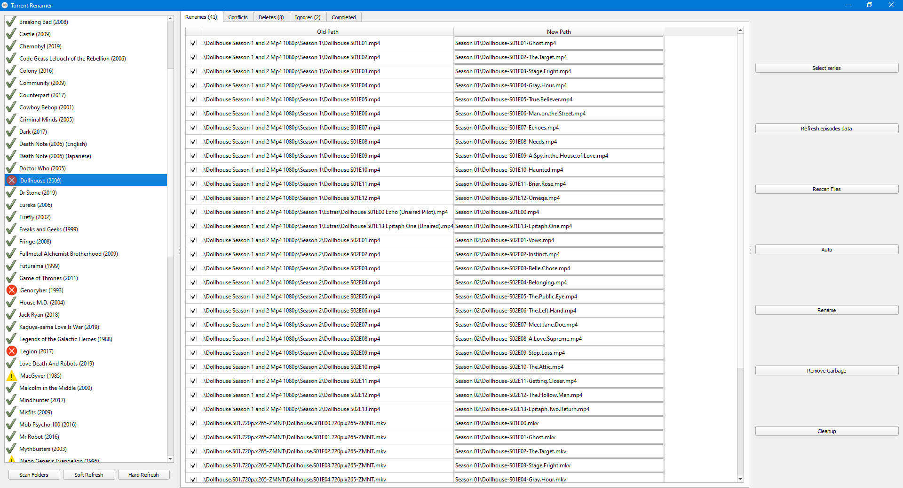

## Torrent Renamer
Renames all torrents to the format {TITLE}-SxxExx-{NAME}.{ext} and places them inside a folder "Season xx". This is useful especially for Plex Media Center, so that it can fetch the correct metadata for each episode.

E.g. A.TV.Show//Season 01//A.TV.Show-S01E01-The.Name.mp4

Uses the 
[tvdb API](https://api.thetvdb.com/swagger)
to get names for the files, then does regex and filtering to rename and delete files.

## Gallery


## Credentials
For both the gui app and cli scripts, you need to supply your TVDB api credentials. 
See "example-credentials.json" for the json template.
The default path that is read is "credentials.json".

## Gui Usage
```bash
# activate your virtual environment or install dependencies
pip install -r requirements.txt

# start the qt gui app for development
fbs run

# build the gui app
fbs freeze
```

## CLI Usage
Run the following scripts (1-4) in the following order.

```bash
# 1. Cache all data about each tv show in each folder inside base
#    For each folder, it will prompt a list of possible tv shows
#    Generates a series.json at the root of the subdirectory
python scripts/cache_series_data.py (base_dir)

# 2. Cache all data about the episodes for each tv show
#    For each folder it generates an episodes.json file
#    This contains a list of data for each episode (to the date)
python scripts/cache_episodes_data.py (base_dir)

# 3. Rename the files inside each folder
#    Uses series.json and episodes.json cache to rename
#    Formats to common format shown at start of readme
#    If out of date, then refresh the cache
#    This can be done by deleting the series.json and episodes.json 
#    then run steps 1 and 2 manually
python scripts/rename_episodes.py (base_dir)

# 4. Remove garbage files inside each folder
#    These are usually .txt or .nfo files that come with the torrent
#    Will ask a prompt for each tv show folder (y/n)
python scripts/delete_garbage.py (base_dir)
```

## Todo
- Move "deleted" files to the recycle bin
- Add a mapping file, which links the original filepath to new filepath
- Implement support for active torrents 
  - Allow for rename while torrent is active
  - Could use symlinks or simply clone files
  - Would require a designated torrenting folder
  - Auto detect when a torrent is active (read state files or use web api)